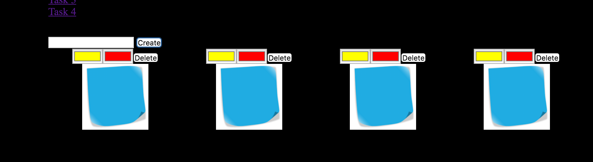
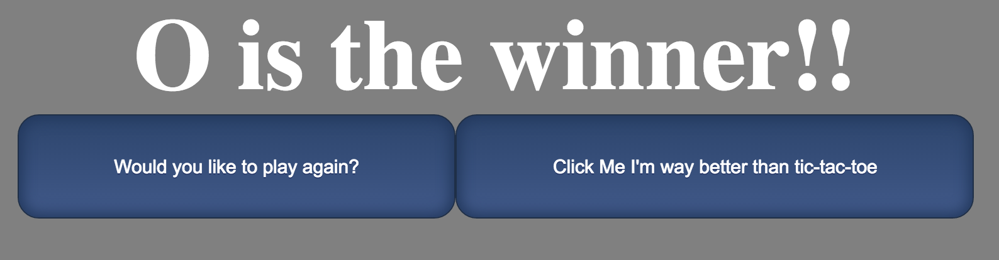

#Tic Tac Toe


## Description
In this exercise I had 4 challenges.
<br>
1. Create an html page with an input and a button. When the button is clicked a new card is created with 2 color inputs and a button element. You can use the color inputs to dynamically change the background and color of the card and the delete button deletes the existing card.
<br>
2. This is an example of what you can do with eventListeners. When you click a given div an eventListener is fired that applys certain attributes using javascript.
<br>
3. This is an example using an eventListener and a timer. When the user clicks the button the div grows by 2x and then after 3 secs returns to the initial size.
<br>
4. I create a Tic Tac Toe game with a hidden easter egg after the game is over. I created the game using javascript, css and html.

## How to run
In your terminal run:
```
http-server -p 9999
```
then navigate to http://localhost:9999 in your browser.

## Screenshots
##Challenge1

##Tic Tac Toe

##Tic Tac Toe Inprogress

##Tic Tac Toe Winner


## Contributors
- [Justin Leggett](https://github.com/justinal64)